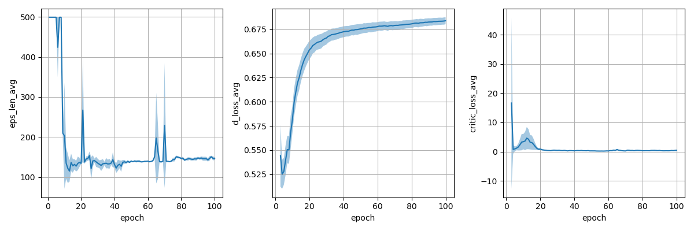
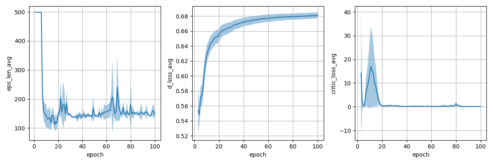

# Implementation of Non-Adversarial Imitation Learning (NAIL)
**TL;DR**: An online imitation learning algorithm with better convergence behavior than Generative Adversarial Imitation Learning using a simple modification.

Implementation based on paper [Non-Adversarial Imitation Learning and its Connections to Adversarial Methods, Arenz & Neumann, 2020](https://arxiv.org/abs/2008.03525). The official implementation can be found [here](https://github.com/OlegArenz/O-NAIL). 

The training loop follows [Discriminator Actor-Critic](https://arxiv.org/abs/1809.02925) and uses [Soft Actor-Critic](https://arxiv.org/abs/1801.01290) as the reinforcement learning algorithm. 

For a short note on the algorithm and implementation see [here](doc/non_adversarial_imitation_learning.pdf).

## Experiment
We perform experiments in the discrete-action mountain car environment. We compute the demonstration policy by discretizing the state space and computing the optimal soft value function in close form. Only a critic is needed in the imitation learning algorithm.

**NAIL learning curve**


**AIL learning curve**


## Usage
To generate demonstrations, run:

```python ./scripts/create_decomstrations.py```

To train the NAIL policy, run:

```sh ./scripts/train_agent.sh```

You can modify the ``-algo`` argument in the ``.sh`` file to train AIL policy.